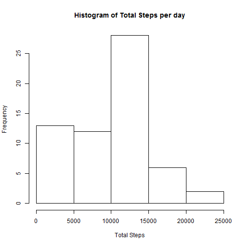
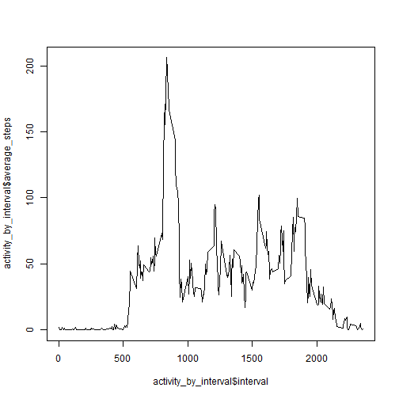
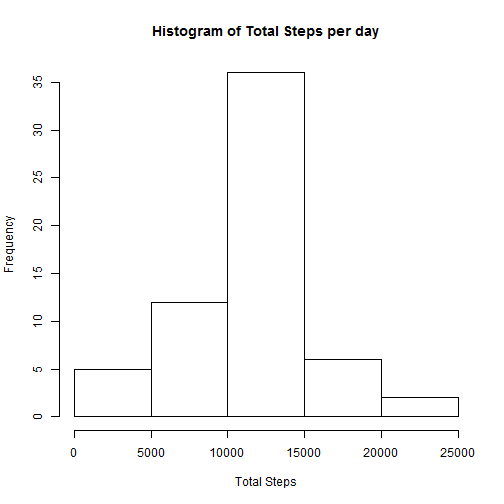

## Loading and preprocessing the data
1. Load the data

```r
# Load the data table library and the csv
library(data.table)
activity_df <- read.csv("activity.csv")
activity <- as.data.table(activity_df)
```
2. Process / transform the data

```r
# Pre-process data, creating a few different versions of the dataset for future questions
activity$date <- as.Date(activity$date)
activity_by_date <- activity[,sum(steps,na.rm=TRUE), by=date]
setnames(activity_by_date, "V1", "total_steps")
activity_by_interval <- activity[,mean(steps,na.rm=TRUE), by=interval]
setnames(activity_by_interval, "V1", "average_steps")
```

## What is mean total number of steps taken per day?
1. Make a histogram of the total number of steps taken each day

```r
hist(activity_by_date$total_steps, xlab="Total Steps", main="Histogram of Total Steps per day")
```

 

2. Calculate and report the **mean** and **median** total number of steps taken per day

```r
# Calculate mean and median numbers of steps, excluding NA values
mean_steps <- mean(activity_by_date$total_steps, na.rm=TRUE)
median_steps <-median(activity_by_date$total_steps, na.rm=TRUE)
```
**Mean Steps**

```r
mean_steps
```

```
## [1] 9354.23
```
**Median Steps**

```r
median_steps
```

```
## [1] 10395
```
## What is the average daily activity pattern?
1. Make a time series plot (i.e. type = "l") of the 5-minute interval (x-axis) and the average number of steps taken, averaged across all days (y-axis)

```r
plot(type="l", activity_by_interval$interval, activity_by_interval$average_steps)
```

 

2. Which 5-minute interval, on average across all the days in the dataset, contains the maximum number of steps?

```r
# Calculate maximum average steps
max_average_steps <- max(activity_by_interval$average_steps)
# Find which interval it occurs in
max_average_steps_interval <- subset(activity_by_interval, average_steps == max_average_steps)$interval
```
**Interval with maximum average steps**

```r
max_average_steps_interval
```

```
## [1] 835
```
## Imputing missing values
1. Calculate and report the total number of missing values in the dataset (i.e. the total number of rows with NAs)

```r
# Find NAs and calculate number
nas <- which(is.na(activity$steps))
total_nas <- length(nas)
```
**Total missing steps values in dataset**

```r
total_nas
```

```
## [1] 2304
```

2. Fill the dataset based on the average value for each five-minute interval.
3. Create a new dataset that is equal to the original dataset but with the missing data filled in.


```r
# Create new dataset
activity_clean <- merge(activity, activity_by_interval, by="interval")
# Fill NAs with average for 5 minute interval
activity_clean$steps[is.na(activity_clean$steps)] <- activity_clean$average_steps[is.na(activity_clean$steps)]
# Remove average_steps column
activity_clean <- activity_clean[,average_steps:=NULL]
```

4. Make a histogram of the total number of steps taken each day and Calculate and report the **mean** and **median** total number of steps taken per day. Do these values differ from the estimates from the first part of the assignment? What is the impact of imputing missing data on the estimates of the total daily number of steps?


```r
activity_clean_by_date <- activity_clean[,sum(steps,na.rm=TRUE), by=date]
setnames(activity_clean_by_date, "V1", "total_steps")
hist(activity_clean_by_date$total_steps, xlab="Total Steps", main="Histogram of Total Steps per day")
```

 

```r
mean_clean_steps <- mean(activity_clean_by_date$total_steps)
```
**Mean steps with imputed value**

```r
mean_clean_steps
```

```
## [1] 10766.19
```

```r
median_clean_steps <- median(activity_clean_by_date$total_steps)
```
**Median steps with imputed values**

```r
median_clean_steps
```

```
## [1] 10766.19
```
*Is the new mean greater than or equal to the original?*

```r
mean_clean_steps >= mean_steps
```

```
## [1] TRUE
```
*Is the new median greater than or equal to the original?*

```r
median_clean_steps >= median_steps
```

```
## [1] TRUE
```

## Are there differences in activity patterns between weekdays and weekends?
1. Create a new factor variable in the dataset with two levels - "weekday" and "weekend" indicating whether a given date is a weekday or weekend day.

```r
activity_clean <- as.data.frame(activity_clean)
activity_clean$weekday <- weekdays(activity_clean$date)
activity_clean$weekday <- gsub("Monday|Tuesday|Wednesday|Thursday|Friday", "Weekday", activity_clean$weekday)
activity_clean$weekday <- gsub("Saturday|Sunday", "Weekend", activity_clean$weekday)
activity_clean$weekday <- as.factor(activity_clean$weekday)
```

2. Make a panel plot containing a time series plot (i.e. type = "l") of the 5-minute interval (x-axis) and the average number of steps taken, averaged across all weekday days or weekend days (y-axis).

```r
# Load ggplot
library(ggplot2)
# Create new dataframe with aggregation by interval and weekday
activity_clean_grouped <- aggregate(activity_clean$steps, by=list(Weekday = activity_clean$weekday, Interval = activity_clean$interval), FUN = mean)
# Draw plot of average steps per 5 minute interval faceted by Weekday
plot <- ggplot(data = activity_clean_grouped, aes(Interval, x, group=1))
plot + geom_line() + facet_grid(.~Weekday) + labs(title = "Average Steps per Interval by Weekday/Weekend", y = "Average number of steps")
```

 
